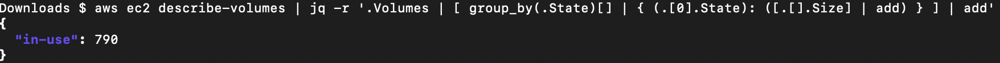

Here are a few useful [AWS CLI](https://aws.amazon.com/cli/) commands mostly inspired by [this article](https://medium.com/circuitpeople/aws-cli-with-jq-and-bash-9d54e2eabaf1).

List all instances in table format
<pre>aws ec2 describe-instances --query 'Reservations[].Instances[].[Placement.AvailabilityZone, State.Name, InstanceId,InstanceType,Platform,Tags.Value,State.Code,Tags.Values]' --output table
</pre>
example output:

What's my user id, account and ARN?
<pre>{ aws sts get-caller-identity & aws iam list-account-aliases; } | jq -s ".|add"
</pre>
example output:

Which of my ec2 security groups are being used?
<pre>{ aws ec2 describe-network-interfaces | jq '[.NetworkInterfaces[].Groups[]|.]|map({ (.GroupId|tostring): true }) 
| add'; aws ec2 describe-security-groups | jq '[.SecurityGroups[].GroupId]|map({ (.|tostring): false })|add'; } | jq -s '[.[1], .[0]]|add|to_entries|[group_by(.value)[]|{ (.[0].value|if . then "in-use" else "unused" end): [.[].key] }]|add'</pre>

Can I list all bucket policies?  I sure can.
<pre>{ for bucket in $(aws s3api list-buckets --query "Buckets[].Name" --output text); do aws s3api get-bucket-policy --bucket $bucket 2>/dev/null; done; } > bucket-policies.txt</pre>

List all S3 buckets in the default region that have 'Public' permissions listed anywhere in the ACL (must have GetBucketAcl or access will be denied.)
<pre>BUCKETS=`aws s3api list-buckets --query 'Buckets[*].Name' --output text | tr " " "\n"`
for BUCKET in $BUCKETS
do
  public=`aws s3api get-bucket-acl --bucket $BUCKET | grep -e 'URI.*http\:\/\/acs\.amazonaws\.com\/groups\/global\/AllUsers\"'`
  if [ ! -z "$public" ]
  then
    echo "$BUCKET"
  fi
done</pre>

List total GB of volumes, by status.

<pre>aws ec2 describe-volumes | jq -r '.Volumes | [ group_by(.State)[] | { (.[0].State): ([.[].Size] | add) } ] | add'</pre>
example output:

