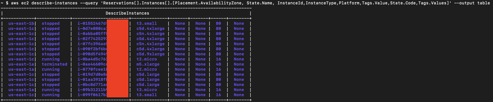
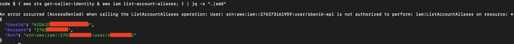

Here are a few useful [AWS CLI](https://aws.amazon.com/cli/) commands.

1) list all instances in table format
<pre>aws ec2 describe-instances --query 'Reservations[].Instances[].[Placement.AvailabilityZone, State.Name, InstanceId,InstanceType,Platform,Tags.Value,State.Code,Tags.Values]' --output table
</pre>
example output:

2) what's my user id, account and ARN?
<pre>{ aws sts get-caller-identity & aws iam list-account-aliases; } | jq -s ".|add"
</pre>
example output:

